# Practica_JER
# GDD: HealFish

## Integrantes
Naroa Jiménez | n.jimenezm.2023@alumnos.urjc.es | naaroojimz@gmail.com
___
Alonso Cancela | a.cancela.2023@alumnos.urjc.es | alonsocancela@gmail.com
___
Ayoze González | a.gonzalezmo.2023@alumnos.urjc.es | ayoze28gm@gmail.com
___
Ignacio Perea | i.perea.2023@alumnos.urjc.es | ipereasedano@gmail.com
___

### Especificaciones básicas
Teniendo en cuenta la fase anterior, el proyecto ha sufrido una gran variedad de cambios positivos a la implementación. Actualmente, existen varios modos, multijugador y local, en los que hay que enfrentarse en un concurso de pesca uno contra uno. El objetivo es pescar el mayor número de peces posible, superando en número al contrincante. A lo largo del juego sucederán 3 fases distintas, en las que se podrán emplear distintos objetos que afectan al transcurso de la partida. Dichos objetos se podrán encontrar en una tienda y son canjeables por dinero. Este dinero se puede obtener vendiendo peces, los cuales existen de distinta rareza. 

## Narrativa

#### Trama Principal
La trama del juego se basa en una competición de pesca entre los dos jugadores, concretamente dos colegas inseparables desde hace mucho tiempo, los cuales llevan centenares de competiciones entre ellos de pesca. Es posible que en próximas actualizaciones se añade más contenido en este apartado.

#### Descripción Personajes

- Protagonista: Yayo García, 27 años, tono de piel claro, ojos marrones y pelo corto, cansado de su insatisfactorio trabajo como oficinista, cuando le aparece un anuncio sobre un restaurante que se alquila decide alquilarlo y vender pescado que él mismo pesca.

- Chica del pueblo: Sabrina, 26 años, rubia, poco a poco se va entablando una relación de amistad con el protagonista abriéndose y contándole sus problemas, abriendo la puerta a más interacciones y eventos. Si se desbloquea un nivel de amistad con ella se puede conseguir una relación formal con ella.

#### Obstaculos en el avance de la historia

- El obstáculo principal de los personajes es también el objetivo del jugador: pescar más peces que el rival.
- Dicha confrontación se podrá nivelar más o menos no solo por la destreza de cada jugador, sino también por la gestión de dinero y objetos.
- 
## Jugabilidad

Como bien se ha mencionado anteriormente, el objetivo del juego será competir contra el rival para ver cual de los dos personajes del juego es el que obtiene mayor número de peces en un tiempo determinado. La dificultad radica en las capacidades del jugador para coordinar sus movimientos con lo que se muestra en la pantalla para obtener peces de manera rápida y eficiente, además de en la capacidad de gestionar objetos y dinero del juego, con un poco de suerte por la probabilidad de cada rareza de pez.

### Mecánicas

Se han desarrollado dos técnicas distintas, una de pesca y otra de gestión.

**Pesca:**
A diferencia de la versión anterior, en vez de generar una barra y que el jugador deba mantenerse dentro de ella, se ha optado por cambiar dicha mecánica para obtener peces. Ahora, deberá pulsar teclas de manera rápida acorde a lo que se muestre por pantalla. 

Parte de la dificultad radica en que para obtener un pez, deberá introducir la tecla que se muestre por pantalla un número determinado de veces, y una vez se pesque al pez, esta combinación cambiará para dar paso a otra distinta con otro pez. 

Además, ahora se nos mostrará que existe un tiempo límite en el que ambos jugadores deberán pescar la mayor cantidad de peces posibles, y una vez acabado ese tiempo, se terminará la competición para ver quién de los dos ha sido el ganador.

Un nuevo apartado que se ha sumado a la pesca es el factor suerte. Se han añadido cuatro rarezas distintas de peces que se pueden pescar, los cuales cuanto más raro es que te salga un pez, mayor puntuación te otorgará.

Por último, un factor determinante que se ha añadido son las fases de pesca. A lo largo de toda la partida, se realizarán 3 fases de pesca, cada una con un temporizador, en las que además de intentar obtener el mayor número de peces, estas serán interrumpidas por pantallas de compraventa de los peces y objetos. Tras la tercera fase, se mostrará por pantalla si el usuario es el ganador o el perdedor de la partida.

**Factor Multijugador:**
El factor multijugador será casi obligatorio para disfrutar la experiencia completa, ya que, a pantalla dividida, los dos jugadores deberán competir por ver cuál de los dos personajes resulta ser el ganador de la competición, es decir, quien pesca más peces en un tiempo determinado. En el proyecto actual se podrá jugar tanto en un apartado local como en un apartado online o de salas.

**Gestión:**
Otro factor que se ha añadido es el empleo de objetos. Estos objetos se pueden obtener en la tienda por dinero, canjeable en una pantalla anterior por los peces. Dichos objetos otorgan distintos factores tanto al usuario como al rival, siendo estos:
- Tijeras, útiles para poder retrasar al rival cortándole el sedal de la caña. Produce una animación inicial en la siguiente fase de pesca, en la que el jugador que sufra su efecto, deberá realizar una combinación similar a la de pescar, solo que en este caso será para poder arreglar el sedal y continuar pescando.
- Cebo, útil para poder aumentar tu suerte a la hora de pescar. Este cebo aumenta la probabilidad del usuario de pescar peces de una rareza mayor, concretamente los tres con la probabilidad más baja, a la vez que disminuye la probabilidad de obtener el pez más común. Este efecto durará hasta el final de la partida, y cada vez que se compre una unidad de este, mejorarán los porcentajes de los peces más raros.
- Sedal especial. Este sedal aumenta la productividad del usuario a la hora de pescar. El uso técnico de este objeto es que reduce el número de veces que se debe pulsar un botón para poder avanzar al siguiente.

Respecto a la mecánica de gestión, el hecho de haber implementado un sistema de economía con los peces obtenidos, y que dicha economía se vuelque en la compra de objetos que mejoran la jugabilidad, producen una idea en el jugador la cual se basa en gestionar de una forma correcta la propia economía de la partida, decidiendo de manera adecuada, según su criterio; cuál es el mejor objeto que me puedo comprar con el dinero que tengo y cuándo es el mejor momento para usar los objetos. 

### Escenarios

**Muelle:** 
En comparación con la anterior versión, se han realizado varios cambios. Sigue siendo un espacio donde se pesca, formado por una escena diseñada en 2D con ángulo contrapicado y un muelle de madera con un puesto de venta de cebos y cañas.

La diferencia comparado con la fase anterior, es que existen varios modelos de muelle, dependiendo de la versión que se juegue:

Si se juega la versión local, se nos mostrará una pantalla dividida. En esta pantalla se encontrarán los dos personajes principales, uno en cada muelle, puesto que habrá un muelle distinto en cada zona. Cada jugador tendrá su propio asiento, en el que se mostrarán en el respaldo la puntuación de cada uno; y un cubo donde los jugadores depositan los peces que han pescado.

Por otra parte, si se juega la versión online, ambos personajes se situarán en dos muelles distintos, pero se situarán uno enfrente del otro, además de que la escena ya no se encontrará dividida. Restando estas diferencias, tanto la situación del asiento con su puntuación como la del cubo serán las mismas que la de la escena local.

## Imagen y Diseño Visual
### Bocetos

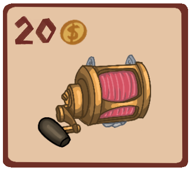
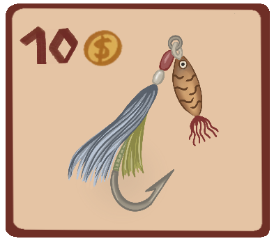
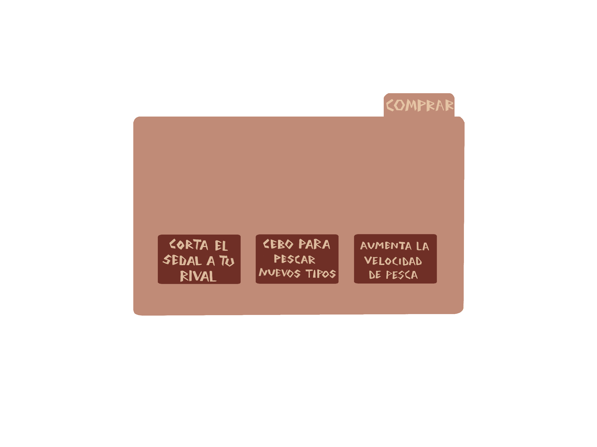

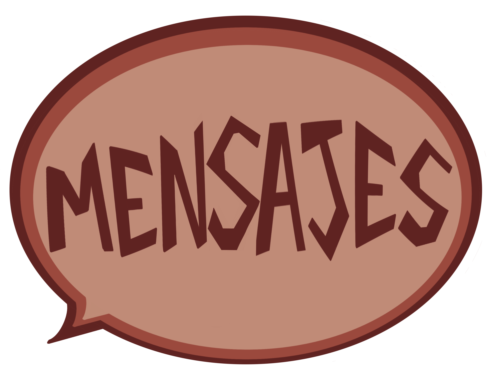

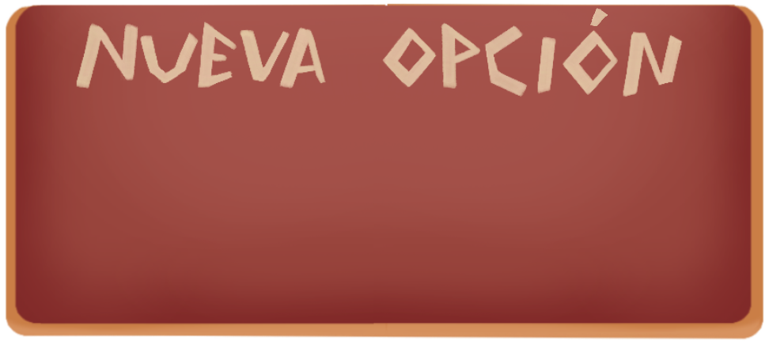
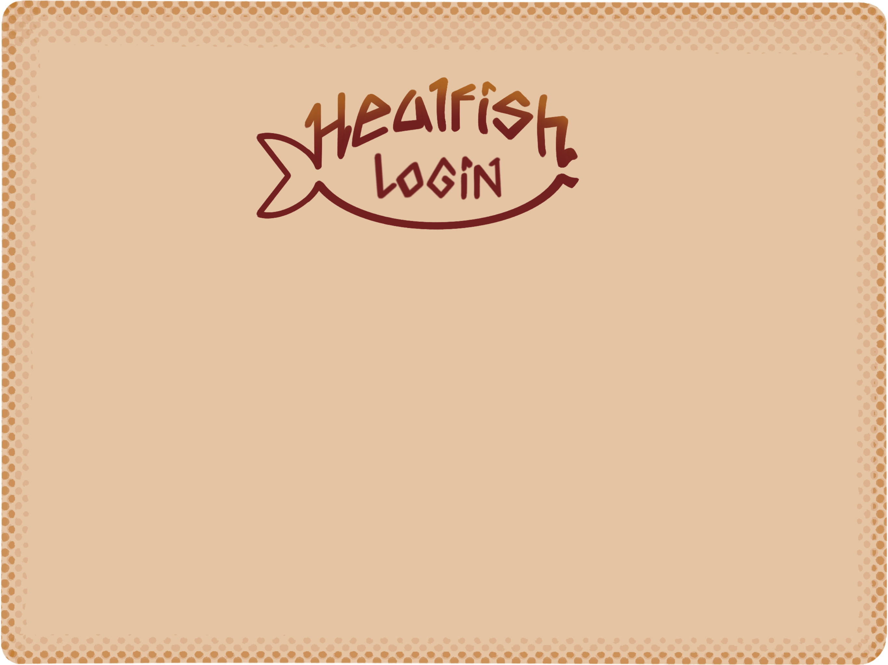
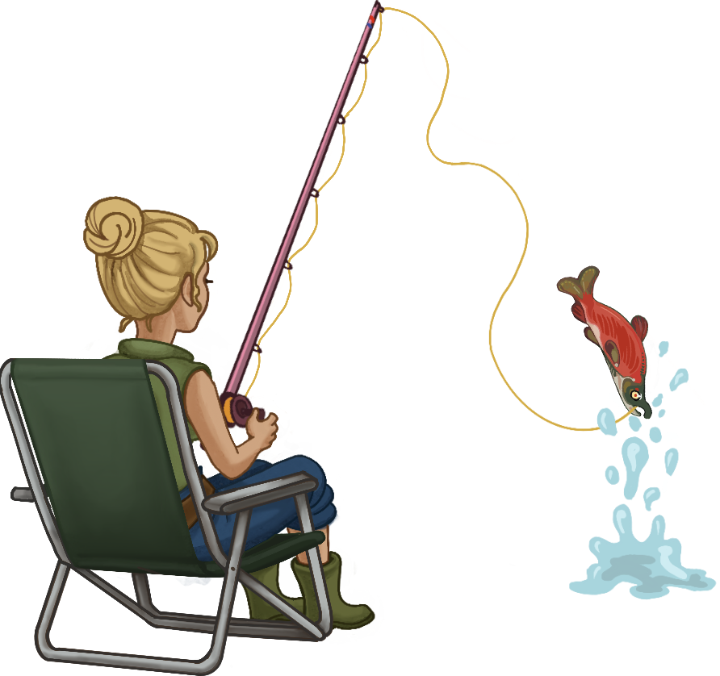
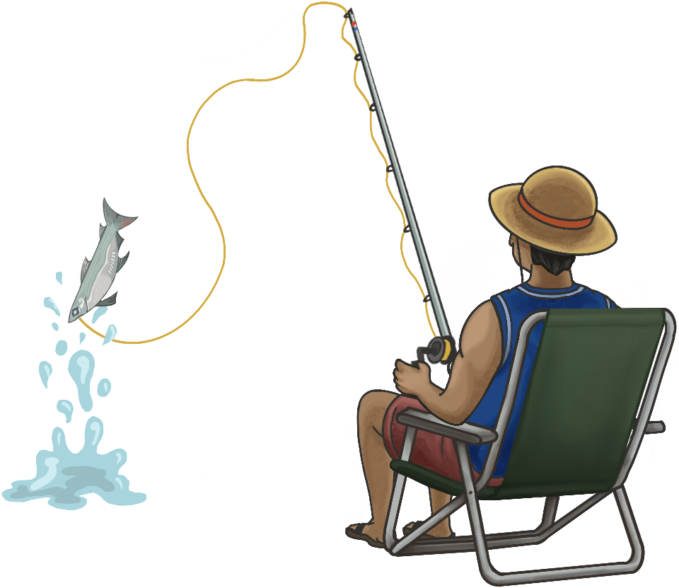
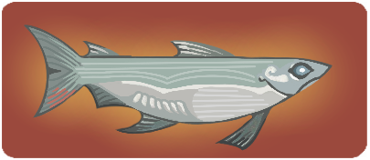
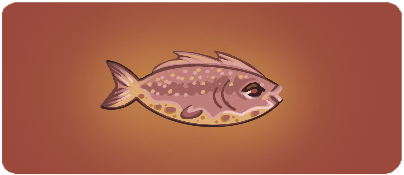
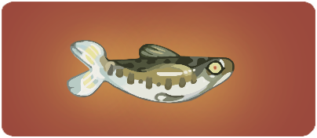
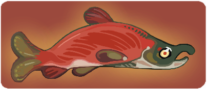
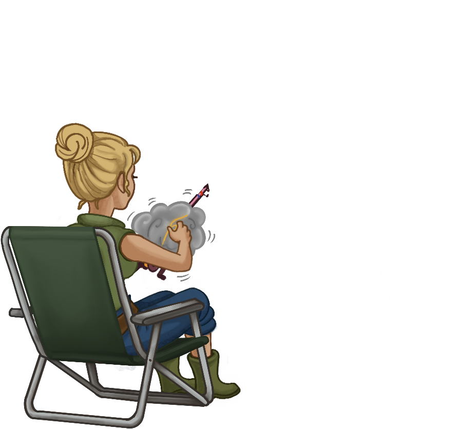
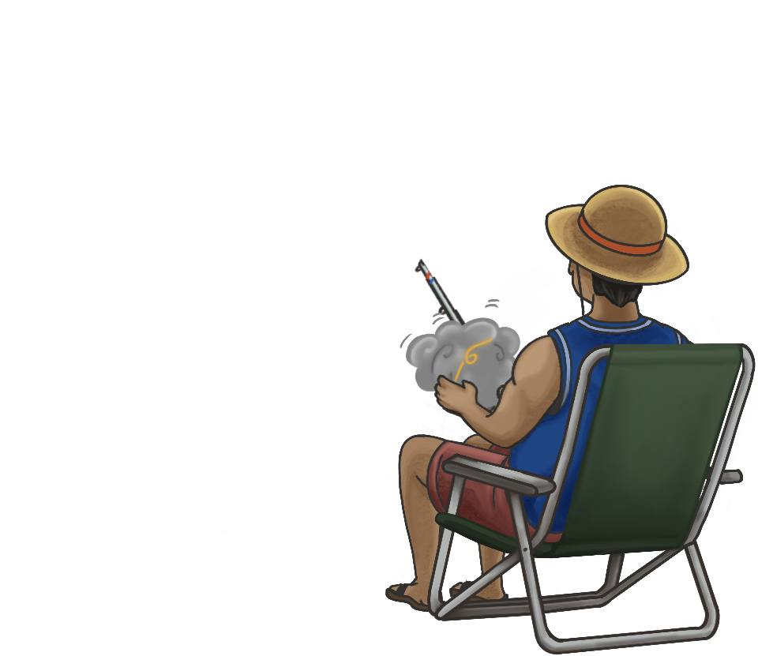

 

### Logotipo

### Descripción Visual

Los personajes diseñados con un estilo caricaturesco y expresivo. Cada figura posee rasgos distintivos que reflejan su personalidad y rol dentro del juego: pescadores, cocineros y clientes del restaurante, todos con proporciones ligeramente exageradas y trazos fluidos. El logotipo combina un pez estilizado con una tipografía orgánica y curvada, evocando dinamismo y frescura.

### Aspectos Técnicos 

Las ilustraciones fueron realizadas digitalmente, utilizando líneas de contorno nítidas y sombreados mínimos para facilitar su posterior vectorización o animación. El logotipo y la portada están preparados para adaptarse tanto a formatos impresos como digitales (menús del juego, icono de aplicación, carteles promocionales, etc.).

La cámara del juego sería en 2D con un movimiento horizontal.

### Estilo Visual

El estilo se sitúa entre el cartoon clásico y el cómic europeo, con un énfasis en la expresividad facial y corporal. Las líneas son limpias pero con un trazo humano, que refuerza la identidad artesanal.
Este enfoque visual busca transmitir calidez, humor y empatía, cualidades que encajan con la narrativa del juego centrada en la pesca, la comunidad y la gestión cotidiana del restaurante.

### Inspiración
La estética se inspira en producciones como “Stardew Valley”, “Animal Crossing” y películas de Studio Ghibli, donde los personajes y los entornos transmiten sencillez y vida cotidiana con un toque poético.
También toma referencias del arte costumbrista y de la ilustración mediterránea, reflejando un ambiente pesquero tradicional reinterpretado con un tono moderno y amable.

## Sonido

#### Banda sonora:

En lo que respecta al apartado músico, se han definido distintas melodías dependiendo de la escena en la que se encuentre. En lo que respecta a las escenas de menú y opciones, se ha elegido música calmada y suave. Por otra parte, para la escena de juego, dado que se trata de una competición a contrarreloj, se ha optado por una opción más acelerada y que destaque mucho más en la propia escena, incluso aportando un poco de protagonismo. Por último, se ha elegido una escena para cuando se termine la partida, en la que el ritmo sea más calmado que en la anterior, ya que se ha acabado el tiempo del cronómetro, pero dado que es reciente y conclusiva del juego, tampoco podía ser tan calmada como la de los menús. 

#### Efectos de sonido:

Los efectos de sonido del juego permiten ofrecer una experiencia mucho más inmersiva a la hora de jugarlo. Además de los comunes efectos como suelen ser la selección de botones, se han añadido algunos tales como el sonido del río, uno de metal, haciendo alusión a cuando se deja al pez en el cubo, una vez pescado, entre otros. Uno bastante notorio e importante, es que cada vez que se pulsen 5 veces la misma tecla, sonará un efecto de sonido que también indique el cambio de tecla, lo que también quiere decir un avance en la pesca.

## Interfaces

- Menú Principal: Interfaz Principal 
- Menú de ajustes: Por Botón o Icono en Pantalla, se accede desde la escena principal o desde la escena pausa.
- Escena Controles: Por botón o Icono en Pantalla, se accede desde la escena instrucciones.
- Menú de pausa: Por Botón o Icono en Pantalla, se accede desde la Escena de Juego y la Escena de Ajustes. 
- Escena Juego:  Por botón o Icono en Pantalla, se accede desde la escena controles o al retomar la escena pausa.
- Escena Créditos: Por botón o Icono en Pantalla, se accede desde la escena de menú principal.
- Escena Instrucciones:  Por botón o Icono en Pantalla, se accede desde la escena de menú principal para juego local, o desde la escena sala de espera para juego multijugador.
- Escena Sala De Espera:  Por botón o Icono en Pantalla, se accede desde la escena de menú principal.
- Escena Tienda: Tras acabar un temporizador en el juego multijugador se accede desde la escena de juego. Únicamente se mostrará las dos primeras veces que termine la ronda de juego.
- Escena Victoria/Derrota: Tras acabar un temporizador en el juego multijugador, se accede desde la escena de juego. Únicamente se mostrará tras la tercera ronda de juego.
- Pantalla Resultados: Tras acabar un temporizador en el juego local. Se accede desde la escena de juego.

### **Explicaciones:**

- En el menú principal se nos mostrarán las opciones de ir a un menú de ajustes, créditos o jugar a la experiencia. En este se enseñará una imagen del logotipo del juego con su nombre incluido. Existen las opciones de jugar tanto de manera local como de manera multijugador. 
- En el menú del juego se nos mostrarán las teclas correspondientes asignadas a la pesca de peces. Además, tiene un menú de pausa donde se puede parar el juego en cualquier momento. Otras opciones que se mostrarán serán los objetos de la tienda. 
- Desde el menú de pausa se podrá volver al juego continuando con la partida, ir al menú de opciones o volver a la pantalla de inicio, seleccionando el botón salir.
- En el menú de ajustes se podrá modificar el nivel del audio, tanto del sonido de fondo como de los botones. También se podrá volver o al menú inicial, en caso de venir desde ahí; o al menú de pausa.
- En el menú de tienda se podrá, primero, vender los peces que se han adquirido en la fase anterior, y segundo, usar ese dinero para comprar objetos de mejora. Para poder continuar a la siguiente fase, ambos jugadores deberán pulsar el botón para continuar. 
- En el menú de sala de espera, se darán dos opciones: crear y unirse a una partida. Tiene su propio fondo tematizado, y dependiendo de qué jugador se ha unido en qué orden, se podrá mostrar a un personaje o a otro sentado en la silla o dejándola vacía. 

### Diagrama de flujo
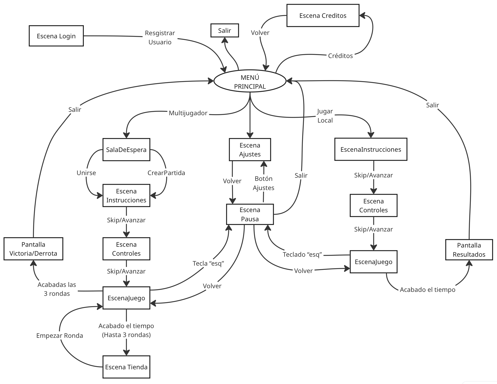

## Comunicación 

Una vez terminadas ambas fases, ya se puede decir que el juego se encuentra en su versión final, lista para disfrutar al completo. Se podrá disfrutar mediante un enlace web para poder jugar tanto online como en local, y a futuro se dispondrán de dichos juegos en diversas plataformas online.

## Referencias bibliográficas:
<https://es.stardewvalleywiki.com/Stardew_Valley_Wiki>

<https://dave-the-diver.fandom.com/wiki/Dave_the_Diver_Wiki>

<https://fliplinestudios.fandom.com/es/wiki/Papa%27s_Pizzeria>

<https://fallout.fandom.com/wiki/Fallout_4>

<https://cookingmama.fandom.com/wiki/Cooking_Mama_Wiki>

<https://www.kickstarter.com/>

