# Practica_JER
# GDD: HealFish

## Integrantes
Naroa Jiménez | n.jimenezm.2023@alumnos.urjc.es | naaroojimz@gmail.com
___
Alonso Cancela | a.cancela.2023@alumnos.urjc.es | alonsocancela@gmail.com
___
Ayoze González | a.gonzalezmo.2023@alumnos.urjc.es | ayoze28gm@gmail.com
___
Ignacio Perea | i.perea.2023@alumnos.urjc.es | ipereasedano@gmail.com
___

### Especificaciones básicas
Con respecto a la versión anterior, se ha simplificado y modificado significativamente el proyecto a desarrollar. En este caso, el juego tratará de una confrontación entre dos jugadores, en la que ambos deberán competir para ver quien es el que logra obtener mayor cantidad de peces, ya que esta experiencia se trata de una competición de pesca. Si bien es cierto que es una simplificación bastante notoria con la versión definida en un principio, en futuras entregas se completará la experiencia, ya que este producto se ha dado debido a la necesidad de simplificar el proyecto y a la falta de tiempo. Continuando con las ideas originales, la plataforma principal inicial para poder jugar será en ordenador. 

## Narrativa

#### Trama Principal
La trama del juego se basa en una competición de pesca entre los dos jugadores, concretamente dos colegas inseparables desde hace mucho tiempo, los cuales llevan centenares de competiciones entre ellos de pesca. Es posible que en próximas actualizaciones se añade más contenido en este apartado.

#### Descripción Personajes

- Protagonista: Yayo García, 27 años, tono de piel claro, ojos marrones y pelo corto, cansado de su insatisfactorio trabajo como oficinista, cuando le aparece un anuncio sobre un restaurante que se alquila decide alquilarlo y vender pescado que él mismo pesca.

- Chica del pueblo: Sabrina, 26 años, rubia, poco a poco se va entablando una relación de amistad con el protagonista abriéndose y contándole sus problemas, abriendo la puerta a más interacciones y eventos. Si se desbloquea un nivel de amistad con ella se puede conseguir una relación formal con ella.

#### Obstaculos en el avance de la historia

- El obstáculo principal de los personajes es también el objetivo del jugador: pescar más peces que el rival. 
Por el momento, no se añadirá más narrativa a la experiencia, debido a las decisiones de simplificación de mecánicas y desarrollo.

## Jugabilidad

Como bien se ha mencionado anteriormente, el objetivo del juego será competir contra el rival para ver cual de los dos personajes del juego es el que obtiene mayor número de peces en un tiempo determinado. La dificultad radica en las capacidades del jugador para coordinar sus movimientos con lo que se muestra en la pantalla para obtener peces de manera rápida y eficiente. 

### Mecánicas

Por el momento, solo se ha desarrollado una mecánica de pesca.

**Pesca:**
A diferencia de la versión anterior, en vez de generar una barra y que el jugador deba mantenerse dentro de ella, se ha optado por cambiar dicha mecánica para obtener peces. Ahora, deberá pulsar teclas de manera rápida acorde a lo que se muestre por pantalla. 

Parte de la dificultad radica en que para obtener un pez, deberá introducir la tecla que se muestre por pantalla un número determinado de veces, y una vez se pesque al pez, esta combinación cambiará para dar paso a otra distinta con otro pez. 

Además, ahora se nos mostrará que existe un tiempo límite en el que ambos jugadores deberán pescar la mayor cantidad de peces posibles, y una vez acabado ese tiempo, se terminará la competición para ver quién de los dos ha sido el ganador.

**Factor Multijugador:**
A diferencia de la versión anterior, ahora el factor multijugador será casi obligatorio para disfrutar la experiencia completa, ya que, a pantalla dividida, los dos jugadores deberán competir por ver cuál de los dos personajes resulta ser el ganador de la competición, es decir, quien pesca más peces en un tiempo determinado.

### Escenarios

**Muelle:** 
En comparación con la anterior versión, se han realizado distintos cambios. Sigue siendo un espacio donde se pesca, formado por una escena diseñada en 2D con ángulo contrapicado y un muelle de madera con un puesto de venta de cebos y cañas.

La interfaz se forma por un contador de peces por cada usuario, las teclas asignadas a cada jugador, donde cada uno tendrá asignada una zona izquierda y derecha del teclado. Dichas teclas se irán mostrando por pantalla en función al número de veces que el jugador la haya pulsado, siendo 5 el número de veces que hace que se pesque al pez y surja otra tecla distinta.
Además, una vez haya terminado el tiempo de pesca, se mostrará cuál  de los dos jugadores es el ganador.

## Imagen y Diseño Visual
### Bocetos
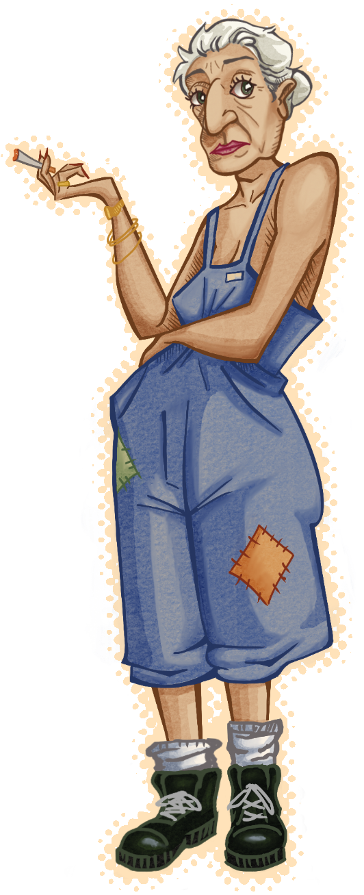
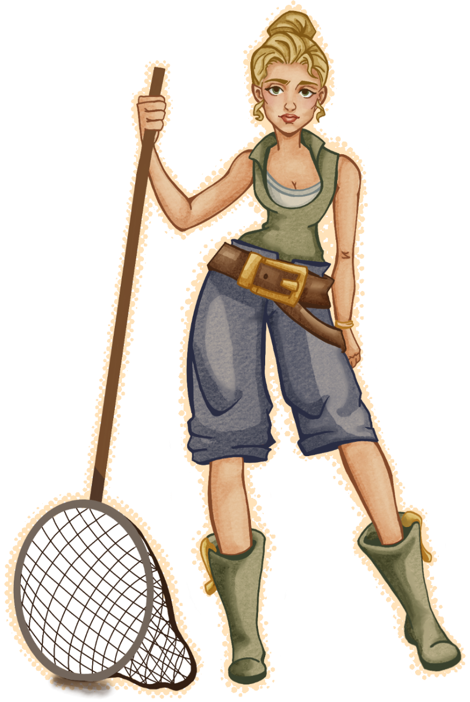
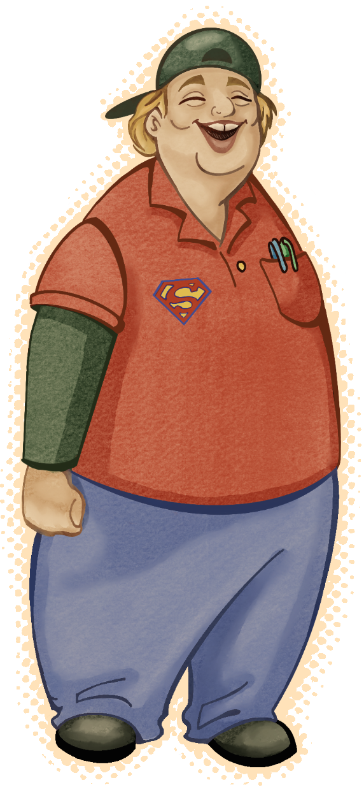
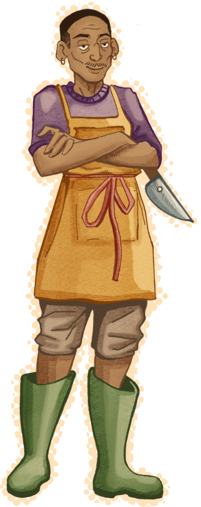
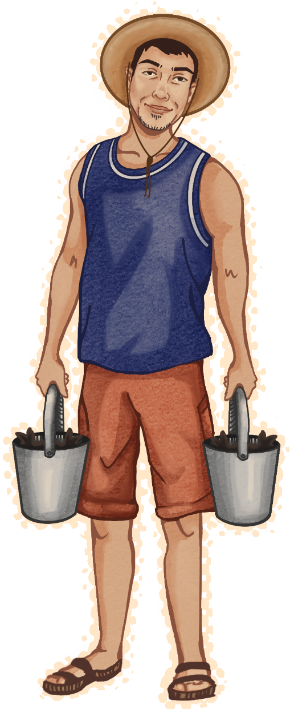
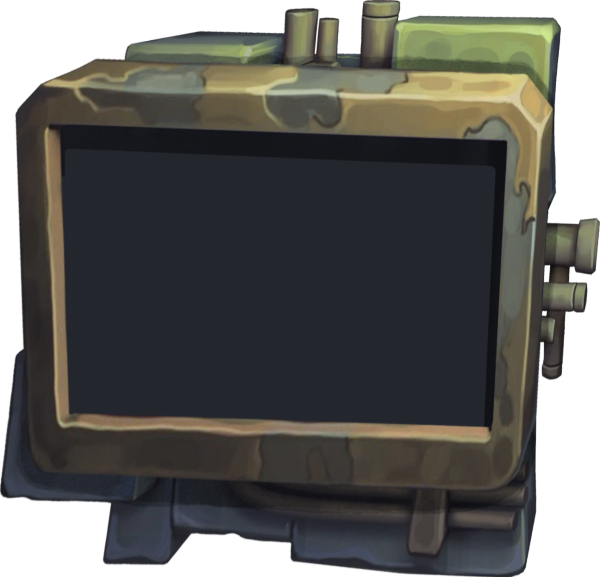
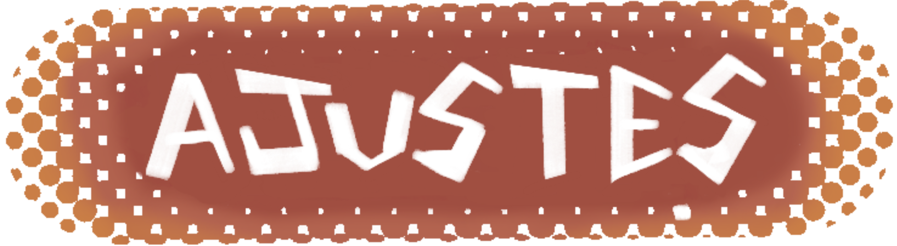
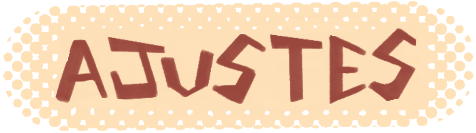
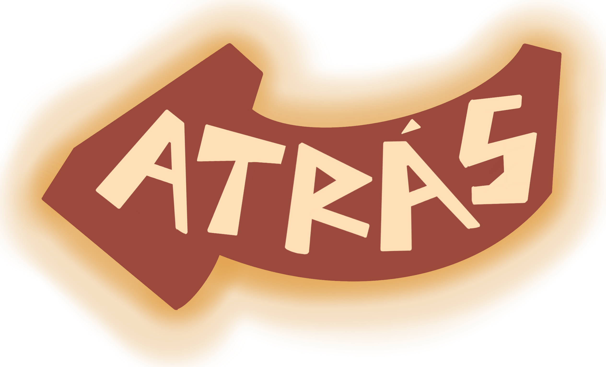
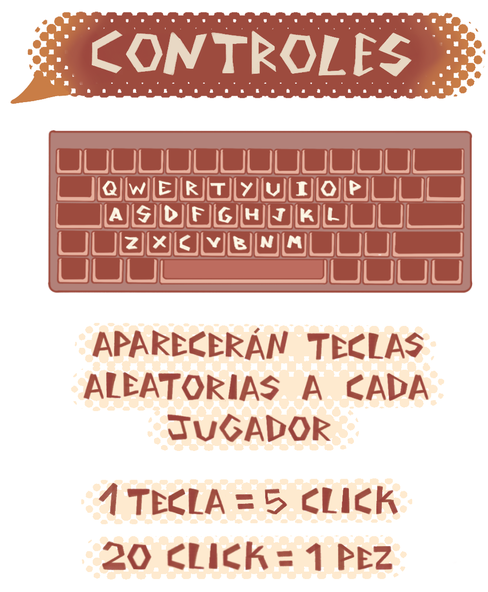
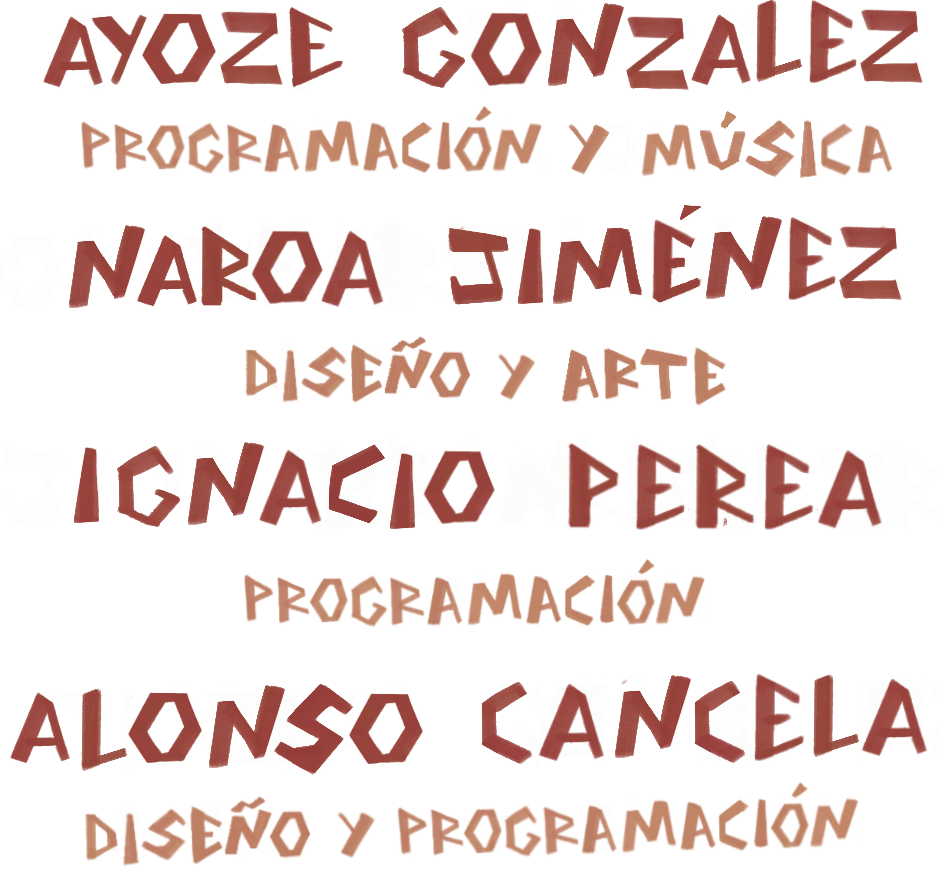
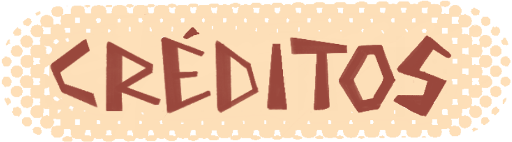
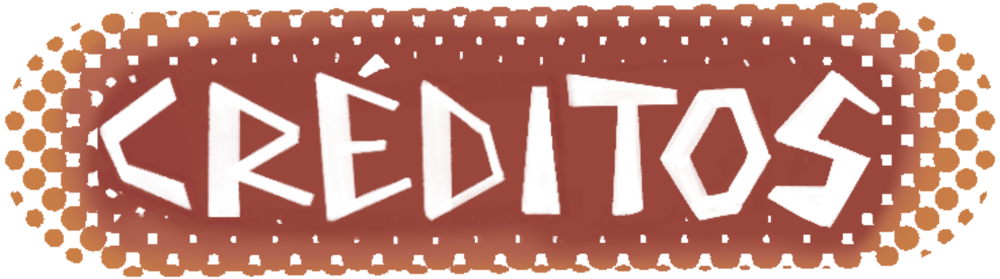

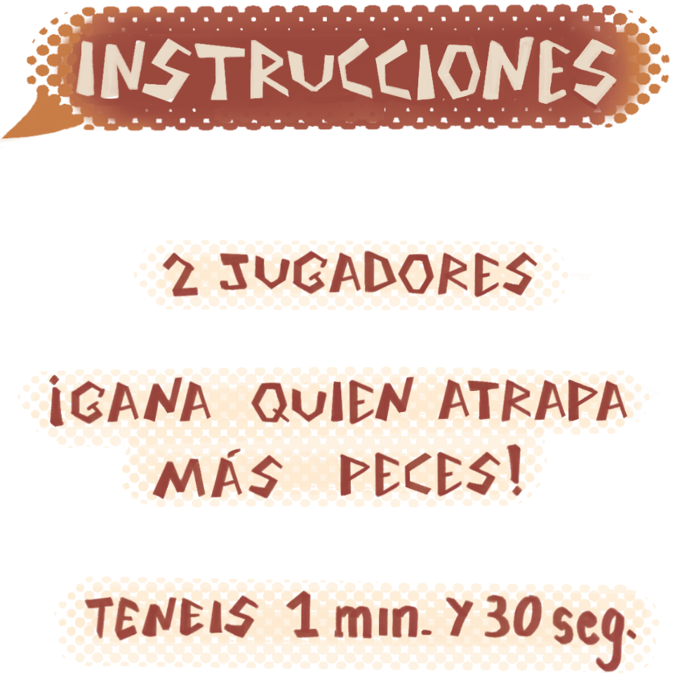
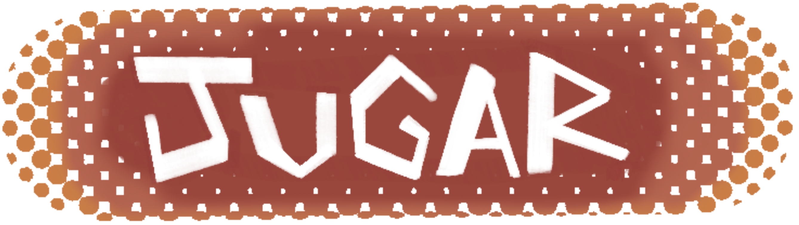

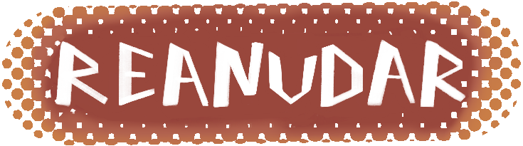

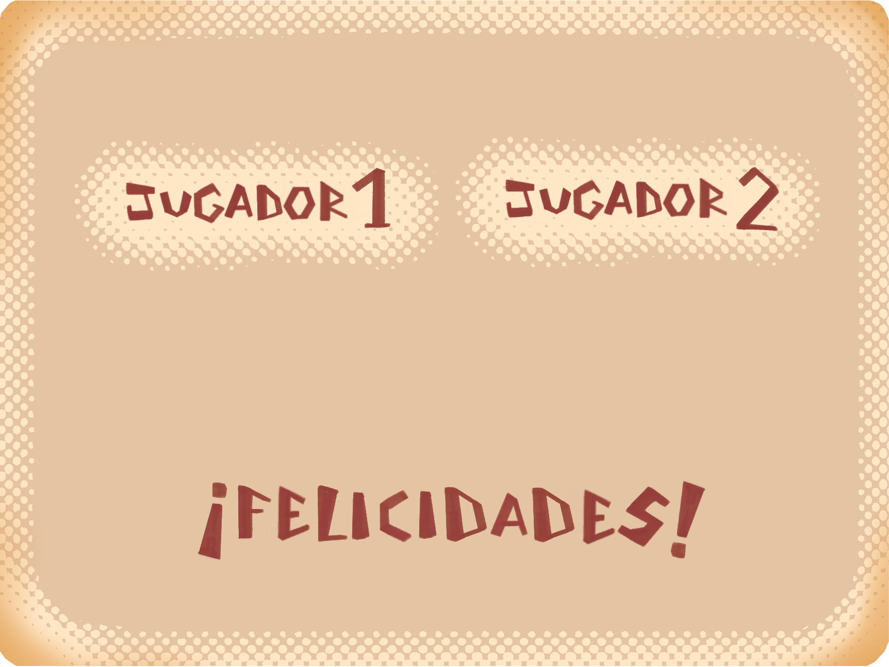

### Logotipo
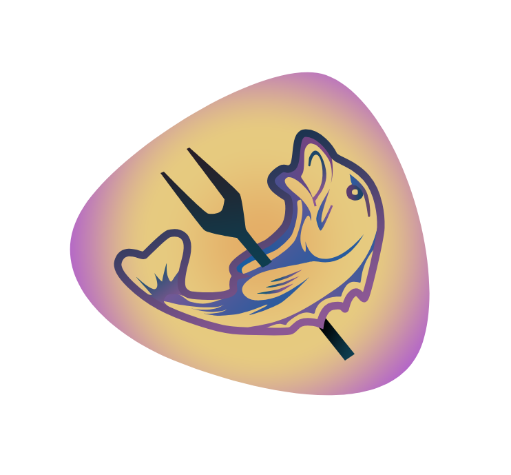
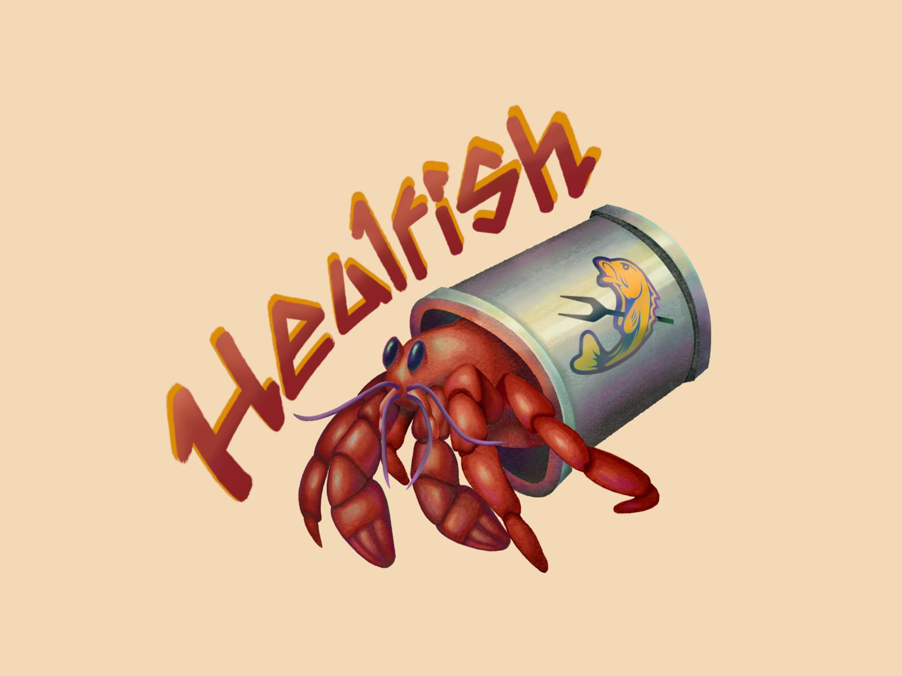

### Descripción Visual

Los personajes diseñados con un estilo caricaturesco y expresivo. Cada figura posee rasgos distintivos que reflejan su personalidad y rol dentro del juego: pescadores, cocineros y clientes del restaurante, todos con proporciones ligeramente exageradas y trazos fluidos. El logotipo combina un pez estilizado con una tipografía orgánica y curvada, evocando dinamismo y frescura.

### Aspectos Técnicos 

Las ilustraciones fueron realizadas digitalmente, utilizando líneas de contorno nítidas y sombreados mínimos para facilitar su posterior vectorización o animación. El logotipo y la portada están preparados para adaptarse tanto a formatos impresos como digitales (menús del juego, icono de aplicación, carteles promocionales, etc.).

La cámara del juego sería en 2D con un movimiento horizontal.

### Estilo Visual

El estilo se sitúa entre el cartoon clásico y el cómic europeo, con un énfasis en la expresividad facial y corporal. Las líneas son limpias pero con un trazo humano, que refuerza la identidad artesanal.
Este enfoque visual busca transmitir calidez, humor y empatía, cualidades que encajan con la narrativa del juego centrada en la pesca, la comunidad y la gestión cotidiana del restaurante.

### Inspiración
La estética se inspira en producciones como “Stardew Valley”, “Animal Crossing” y películas de Studio Ghibli, donde los personajes y los entornos transmiten sencillez y vida cotidiana con un toque poético.
También toma referencias del arte costumbrista y de la ilustración mediterránea, reflejando un ambiente pesquero tradicional reinterpretado con un tono moderno y amable.

## Sonido

#### Banda sonora:

En lo que respecta al apartado músico, se han definido distintas melodías dependiendo de la escena en la que se encuentre. En lo que respecta a las escenas de menú y opciones, se ha elegido música calmada y suave. Por otra parte, para la escena de juego, dado que se trata de una competición a contrarreloj, se ha optado por una opción más acelerada y que destaque mucho más en la propia escena, incluso aportando un poco de protagonismo. Por último, se ha elegido una escena para cuando se termine la partida, en la que el ritmo sea más calmado que en la anterior, ya que se ha acabado el tiempo del cronómetro, pero dado que es reciente y conclusiva del juego, tampoco podía ser tan calmada como la de los menús. 

#### Efectos de sonido:

Los efectos de sonido del juego permiten ofrecer una experiencia mucho más inmersiva a la hora de jugarlo. Además de los comunes efectos como suelen ser la selección de botones, se han añadido algunos tales como el sonido del río, uno de metal, haciendo alusión a cuando se deja al pez en el cubo, una vez pescado, entre otros. Uno bastante notorio e importante, es que cada vez que se pulsen 5 veces la misma tecla, sonará un efecto de sonido que también indique el cambio de tecla, lo que también quiere decir un avance en la pesca.

## Interfaces

- Menú Principal: Interfaz Principal
- Menú de ajustes: Por Botón o Icono en Pantalla
- Escena Controles: Por botón o Icono en Pantalla, se accede desde la escena instrucciones
- Menú de pausa: Por Botón o Icono en Pantalla, se accede desde la Escena de Juego y la Escena de Ajustes
- Escena Juego:  Por botón o Icono en Pantalla, se accede desde la escena controles
- Escena Victoria: Por evento, se accede desde la escena de juego
- Escena Créditos: Por botón o Icono en Pantalla, se accede desde la escena de menú principal
- Escena Instrucciones:  Por botón o Icono en Pantalla, se accede desde la escena de menú principal

### **Explicaciones:**

- En el menú principal se nos mostrarán las opciones de ir a un menú de ajustes, créditos o jugar a la experiencia. En este se enseñará una imagen del logotipo del juego con su nombre incluido.

- En el menú del juego se nos mostrarán las teclas correspondientes asignadas a la pesca de peces. Además, tiene un menú de pausa donde se puede parar el juego en cualquier momento.
  
- Desde el menú de pausa se podrá volver al juego continuando con la partida, ir al menú de opciones o volver a la pantalla de inicio, seleccionando el botón salir.
  
- En el menú de ajustes se podrá modificar el nivel del audio, tanto del sonido de fondo como de los botones. También se podrá volver o al menú inicial, en caso de venir desde ahí; o al menú de pausa.

### Diagrama de flujo
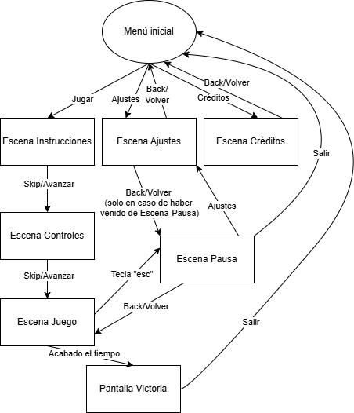

## Comunicación 

Una vez lanzada esta versión del juego, se establecerá como acceso anticipado, ya que se irá actualizando en distintas versiones de manera continua, siendo esta la versión más básica de la experiencia final que realmente se quiere ofrecer.

## Referencias bibliográficas:
<https://es.stardewvalleywiki.com/Stardew_Valley_Wiki>

<https://dave-the-diver.fandom.com/wiki/Dave_the_Diver_Wiki>

<https://fliplinestudios.fandom.com/es/wiki/Papa%27s_Pizzeria>

<https://fallout.fandom.com/wiki/Fallout_4>

<https://cookingmama.fandom.com/wiki/Cooking_Mama_Wiki>

<https://www.kickstarter.com/>

