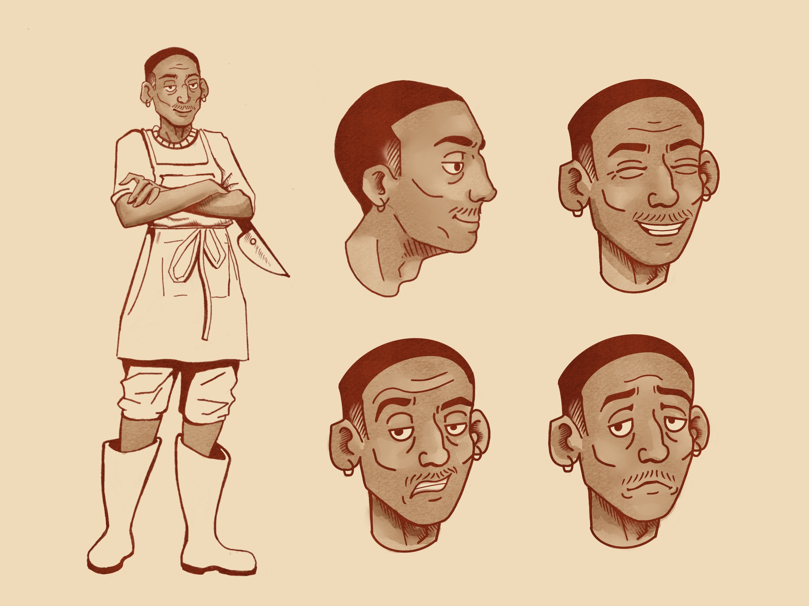
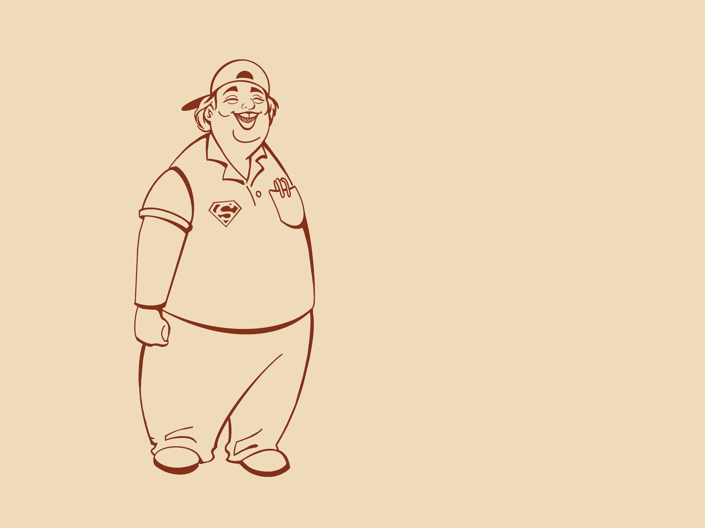

# Practica_JER
# GDD: HealFish

## Integrantes
Naroa Jiménez | n.jimenezm.2023@alumnos.urjc.es | naaroojimz@gmail.com
___
Alonso Cancela | a.cancela.2023@alumnos.urjc.es | alonsocancela@gmail.com
___
Ayoze González | a.gonzalezmo.2023@alumnos.urjc.es | ayoze28gm@gmail.com
___
Ignacio Perea | i.perea.2023@alumnos.urjc.es | ipereasedano@gmail.com
___

### Especificaciones básicas
El juego a diseñar se trata de un “slice of life” (un cachito de vida) de simulación, gestión, dificultad progresiva dirigido a un público bastante genérico, rangos desde la adolescencia a la adultez. Las plataformas elegidas para el juego, inicialmente sería en ordenador, pero se podría implementar también para consolas. 

## Narrativa

#### Trama Principal
Salomé renuncia a todo e invierte todo su dinero por su sueño (restaurante), y poco a poco irá aprendiendo todo lo necesario para salir adelante. Conforme avance en el juego, el jugador irá conociendo más sobre su niñez en el pueblo, las relaciones con otros personajes y esencialmente con su familia. También al propio jugador se le irá informando sobre los motivos por los que el protagonista abandonó el pueblo y los misterios que este todavía esconde.

#### Descripción Personajes

- Protagonista: Salomé García, 27 años, tono de piel claro, ojos marrones y pelo corto, cansado de su insatisfactorio trabajo como oficinista, cuando le aparece un anuncio sobre un restaurante que se alquila decide alquilarlo y vender pescado que él mismo pesca.

- Co-protagonista: Mané, 27 años, antiguo amigo del protagonista, tiene tono de piel oscuro, ojos marrones y pelo corto, siempre le ha fascinado el mundo de la pesca y al ver que el protagonista alquila un restaurante relacionado a ello decide ayudarle.

- Anciana del pueblo: Carmen Gloria, 64 años, funcionaria en el ayuntamiento, fumadora y de carácter difícil, irá en sus descansos a comer al restaurante y podrá facilitar algún papeleo.

- Friki del pueblo: Franco, 27 años, sabelotodo, descuida su aspecto y forma física, vive con sus padres, juega videojuegos y colecciona cartas pokemon, invierte en acciones y criptomonedas. A pesar de tener dinero suficiente para independizarse prefiere vivir junto a sus padres. Podrá ayudar al protagonista con sus conocimientos financieros.

- Chica del pueblo: Sabrina, 26 años, rubia, poco a poco se va entablando una relación de amistad con el protagonista abriéndose y contándole sus problemas, abriendo la puerta a más interacciones y eventos. Si se desbloquea un nivel de amistad con ella se puede conseguir una relación formal con ella.

- Casero: Juan Francisco, 61 años, hombre de mediana edad, arisco, el protagonista no le inspira confianza debido a su corta edad.

#### Obstaculos en el avance de la historia

- El casero pide más dinero, pone trabas, se mete en todo en respecto al local, etc.

- Algunos alimentos tienen anisakis y hay que congelarlos, sino la gente empieza a ponerse mala y llega un punto que si hay “x” número de gente mala se corre la voz y viene un señor (inspección de sanidad) a ponerte una multa por no cumplir la inspección, la multa se tendrá que pagar antes de que caiga la noche al igual que la cuota diaria del restaurante.

- Eventos: asalto nocturno a la tienda; condiciones metereológicas; protestas ecológicas.

- Clientes problemáticos: clientes que son más exigentes que el resto, intentando encontrar cualquier cosa para quejarse.

- Epidemias de fiebre o similar que derive en menos clientela durante días.

#### Cinemática inicial:
1. Protagonista delante de PC en oficina (fondo de pantalla; un mar/pesca).
2. Primer plano del protagonista; cara de angustia, aburrimiento y cansancio.
3. Alguien deja caer pila de papeles en la mesa.
4. Ordenador; salta el anuncio de un local al lado del mar.
5. El protagonista gira su atención hacia una foto de un hombre y un niño pescando (su padre y él).
6. (Si hay más de un jugador el protagonista llama por teléfono y en función del número de jugadores habla con uno o más) (La idea de la escena es que salga el protagonista hablando por teléfono y mediante “bocadillos” mostrar: restaurante; personas en función de la cantidad de jugadores; y signo de interrogación)
7. Un autobús frena frente a una parada y de ahí salen el/los protagonistas.
8. Se muestra la o las carteras/cuentas del banco vacías.
9. Empieza el juego.

## Jugabilidad

El objetivo del juego es sobrevivir el día a día mezclando las mecánicas principales, tanto para obtener los ingresos suficientes como para subsistir con los pagos e inconvenientes que nos irán surgiendo conforme se vaya progresando en el propio juego. La dificultad de este radica en que según se vayan mejorando los elementos, alimentos y demás también se nos impondrán obstáculos y dificultades a la hora de realizar las distintas tareas, además de que los pagos irán en aumento conforme se avance.

### Mecánicas

El juego se basa en dos mecánicas principales: pesca y cocina.

**Pesca:**
Estilo “Stardew Valley”, minijuego sencillo donde mediante inputs del ratón se intenta mantener una barra dentro de una zona delimitada y variable durante la acción. La dificultad del “evento” depende de la “calidad” o “rareza” del pez que pique.

Mediante mejoras de los objetos involucrados (caña, cebo, carrete, anzuelo, etc) que cuesten puntos/dinero el jugador puede conseguir mejores recompensas o facilitar el minijuego.

**Cocina:**
Inspirado en “Cooking Mama” y “Papa’s Pizzeria”, las distintas tareas de la cocina (pelar, cortar, remover, hornear, calentar, cocinar, emplatar, etc) se definen y completan mediante minijuegos interactivos.

El punto del minijuego es que el jugador lo haga lo mejor posible en base a unos parámetros para así conseguir mejores recompensas.

**Otras mecánicas:**
Además de las dos principales hay más mecánicas como la gestión del restaurante y la mejora de las instalaciones. El restaurante debe ser atendido; los pedidos de los NPC’s tienen que ser realizados; las mesas deben estar limpias; la comida debe ser entregada. 

Durante el transcurso del juego se tendrá que pagar el alquiler del local que cada vez será más caro, así hasta poder comprar del todo el local.

Al principio el local será básico e insuficiente para poder atender a una gran cantidad de clientes, por lo que el jugador tiene disponible una serie de mejoras del local como: contratar empleados (camareros, cocineros, limpiadores, pescadores, etc), mejorar las instalaciones (cocina, salón, neveras, etc); conseguir permisos y licencias.

**Factor Multijugador:**
Cuando haya más de un jugador en la partida, ambos pueden realizar la misma acción o alternarse entre ellas para facilitar el progreso en el juego.

### Escenarios

**Muelle:** 
El espacio donde se pesca es una escena diseñada en 2D con ángulo contrapicado, es un muelle de madera con un puesto de venta de cebos y cañas de 7 de la mañana a 5 de la tarde. Se puede pescar poniéndote en alguna de las casillas que delimitan el borde del muelle apuntando al agua con la caña. La interfaz indicará al jugador cuándo podrá sacar el pez o molusco pescado. La escena está orientada a la mecánica de pesca, pero gracias a la economía interna del juego se podrán conseguir avances en el muelle, como por ejemplo, un soporte estático o trampas, para que el jugador pueda conseguir peces de manera automática sin necesidad de estar constantemente pescando. Así mismo, conforme avance el juego y el grupo de jugadores consigan más dinero el muelle se podrá agrandar. 

**Restaurante:**
El espacio del restaurante es una escena diseñada en 2D con ángulo contrapicado. Consta de una barra con varios taburetes y una espacio con mesas desde 2 hasta 4 personas, una gramola y una diana de dardos. Este es un espacio diseñado para la mecánica de tomar nota a los clientes y que segundos o terceros jugadores sirvan los platos previamente cocinados. También deberán tener el establecimiento limpio para seguir atendiendo a más clientes y ofrecerles mesa, y muy importante, para no tener ninguna multa de sanidad.  

**Cocina:**
El espacio donde se cocina es una escena diseñada en 2D con ángulo contrapicado para tener visibilidad a todo el espacio de trabajo, pero está sujeta a cambios para implementarla en 3D. 

Es una mesa de trabajo donde se da lugar a la mecánica principal del juego de cocinar. Para ello lo hemos dividido en tres espacios de trabajo: 
En primer lugar, el área de limpieza del pez o molusco, subdividido en otras tres áreas: descamar, destripar y limpiar con agua. 
Segunda mesa de trabajo, elaboración del plato, con otras tres subclases: cortar, condimentar y cocinar. 
Por último, se encuentra la mesa de emplatado, donde se finaliza el plato combinándolo con los acompañamientos o guarniciones solicitados por el cliente.

## Imagen y Diseño Visual
### Bocetos

### Logotipo

### Descripción Visual

Los personajes diseñados con un estilo caricaturesco y expresivo. Cada figura posee rasgos distintivos que reflejan su personalidad y rol dentro del juego: pescadores, cocineros y clientes del restaurante, todos con proporciones ligeramente exageradas y trazos fluidos. El logotipo combina un pez estilizado con una tipografía orgánica y curvada, evocando dinamismo y frescura.

### Aspectos Técnicos 

Las ilustraciones fueron realizadas digitalmente, utilizando líneas de contorno nítidas y sombreados mínimos para facilitar su posterior vectorización o animación. El logotipo y la portada están preparados para adaptarse tanto a formatos impresos como digitales (menús del juego, icono de aplicación, carteles promocionales, etc.).

La cámara del juego sería en 2D con un movimiento horizontal.

### Estilo Visual

El estilo se sitúa entre el cartoon clásico y el cómic europeo, con un énfasis en la expresividad facial y corporal. Las líneas son limpias pero con un trazo humano, que refuerza la identidad artesanal.
Este enfoque visual busca transmitir calidez, humor y empatía, cualidades que encajan con la narrativa del juego centrada en la pesca, la comunidad y la gestión cotidiana del restaurante.

### Inspiración
La estética se inspira en producciones como “Stardew Valley”, “Animal Crossing” y películas de Studio Ghibli, donde los personajes y los entornos transmiten sencillez y vida cotidiana con un toque poético.
También toma referencias del arte costumbrista y de la ilustración mediterránea, reflejando un ambiente pesquero tradicional reinterpretado con un tono moderno y amable.

## Sonido

#### Banda sonora:

Dependiendo del clima sonará una música u otra. En días soleados, se escucharán melodías alegres y relajadas que inviten a explorar y pescar; durante la lluvia, la música será más tranquila y melancólica, acompañada por el sonido ambiental de las gotas; en las noches despejadas, sonarán temas suaves y envolventes que transmitan calma; mientras que en las tormentas, la banda sonora adoptará un tono más intenso para resaltar la tensión del entorno. 

#### Efectos de sonido:

Las distintas interacciones tendrán sonidos únicos. Algunos efectos a destacar serían: tener éxito en el minijuego de pesca, el chapoteo del agua, el sonido del carrete al recoger la caña y el sonido de una campana al conseguir la pesca; cocinar, el crepitar del fuego y el chisporroteo de la sartén; cortar, el golpeteo rítmico del cuchillo sobre la tabla; caminar, los pasos que varían según el terreno (madera, tierra o arena); recibir propina, el tintineo alegre de monedas; abrir o cerrar el restaurante, un suave sonido de campanilla en la puerta; y servir los platos, el choque de platos y cubiertos al colocarlos sobre la mesa.

## Interfaces

- Menú Principal | Interfaz Principal | Menú de Restaurante*

- Inventario | Por Botón | Caja de Pesca*

- Menú del Juego | Por Botón o Icóno en Pantalla | Timón*

- Opciones | Desde el Menú Principal o Menú In Game | Sonda*

- Cocinar (varias escenas) | Por Botón o Icono en Pantalla | Estilo Coocking Mama / Papa’sPizzeria*

- Pescar | Por Botón | Estilo Stardew Valley*

- Interfaz Principal | Interfaz Base del Juego | Mirar explicación*

### **Explicaciones:**

- Menú de Restaurante: el menú principal se asemejaría al menú de un restaurante, siendo las opciones de la carta los botones de “Nueva Partida”, “Continuar”, “Opciones”, “Créditos”, “Salir”.

- Caja de Pesca: al abrir el inventario, animación de una caja de pesca abriéndose, los compartimentos son los slots de inventario, aumentando con mejoras

- Timón: tras entrar al menú, se despliega con una animación un timón en pantalla, donde cada cabilla sirve de botón (continuar, guardar, cargar, opciones, salir al menú), al seleccionar una de las cabillas, el timón se mueve hasta “poner ese rumbo”.

- Sonda: el menú de opciones imita una sonda al estilo “Pip Boy” del “ Fallout 4 ”

- Cocinar: estilo Coocking Mama con minijuegos interactivos (cortar, pelar, freir, emplatar…), variando la interfaz dependiendo de la tarea.

- Pesca: estilo Stardew Valley, varía de si la pesca es en tierra o en barco.

- Interfaz Principal: en la pantalla de juego se muestra una serie de estadísticas: dinero, dia, hora, progreso, etc; el icóno del menú (timón); el botón a usarse para interactuar con algo; etc.

### Diagrama de flujo

## Comunicación 

Respecto a la estrategia de marketing ideada para este proyecto, para comenzar se iniciaría un proyecto en “kickstarter”, con propuestas atractivas para que los usuarios inviertan en el proyecto y consiga salir adelante. Otras opciones que se contemplarán serían solicitar publicitar el proyecto en eventos como la presentación indie de Nintendo o permiso para presentarlo en elementos como el Game Pass de Xbox.

## Referencias bibliográficas:
<https://es.stardewvalleywiki.com/Stardew_Valley_Wiki>

<https://dave-the-diver.fandom.com/wiki/Dave_the_Diver_Wiki>

<https://fliplinestudios.fandom.com/es/wiki/Papa%27s_Pizzeria>

<https://fallout.fandom.com/wiki/Fallout_4>

<https://cookingmama.fandom.com/wiki/Cooking_Mama_Wiki>

<https://www.kickstarter.com/>

